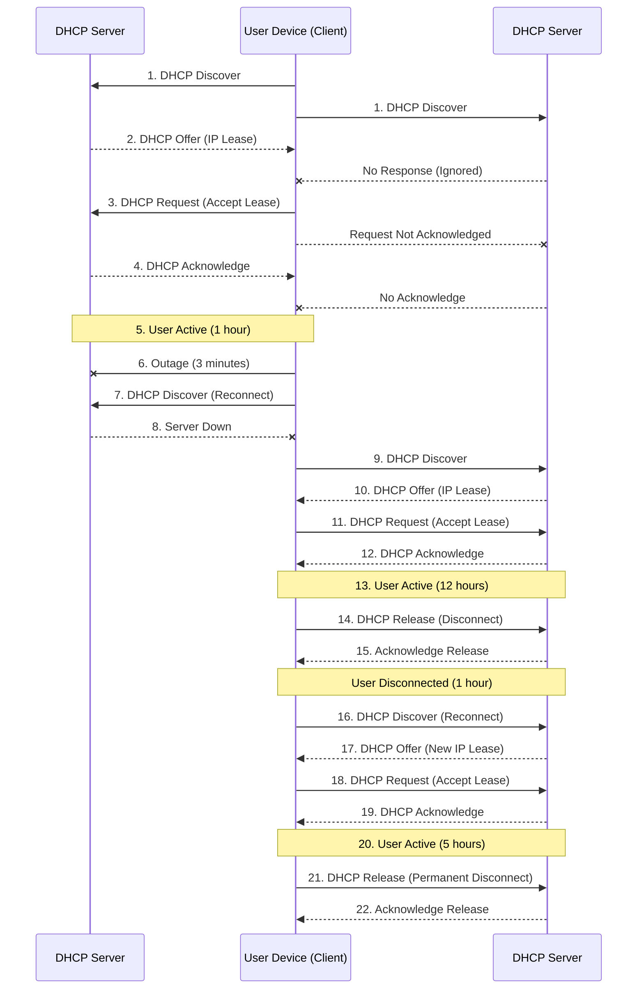

```mermaid


sequenceDiagram
    participant Server1 as DHCP Server #1
    participant User as User Device (Client)
    participant Server2 as DHCP Server #2

    User->>Server1: 1. DHCP Discover
    User->>Server2: 1. DHCP Discover

    Server1-->>User: 2. DHCP Offer (IP Lease)
    Server2--x User: No Response (Ignored)

    User->>Server1: 3. DHCP Request (Accept Lease)
    User--x Server2: Request Not Acknowledged

    Server1-->>User: 4. DHCP Acknowledge
    Server2--x User: No Acknowledge

    Note over User,Server1: 5. User Active (1 hour)

    User-x Server1: 6. Outage (3 minutes)
    User->>Server1: 7. DHCP Discover (Reconnect)
    Server1--x User: 8. Server Down

    User->>Server2: 9. DHCP Discover
    Server2-->>User: 10. DHCP Offer (IP Lease)
    User->>Server2: 11. DHCP Request (Accept Lease)
    Server2-->>User: 12. DHCP Acknowledge

    Note over User,Server2: 13. User Active (12 hours)

    User->>Server2: 14. DHCP Release (Disconnect)
    Server2-->>User: 15. Acknowledge Release

    Note over User,Server2: User Disconnected (1 hour)

    User->>Server2: 16. DHCP Discover (Reconnect)
    Server2-->>User: 17. DHCP Offer (New IP Lease)
    User->>Server2: 18. DHCP Request (Accept Lease)
    Server2-->>User: 19. DHCP Acknowledge

    Note over User,Server2: 20. User Active (5 hours)

    User->>Server2: 21. DHCP Release (Permanent Disconnect)
    Server2-->>User: 22. Acknowledge Release

```
